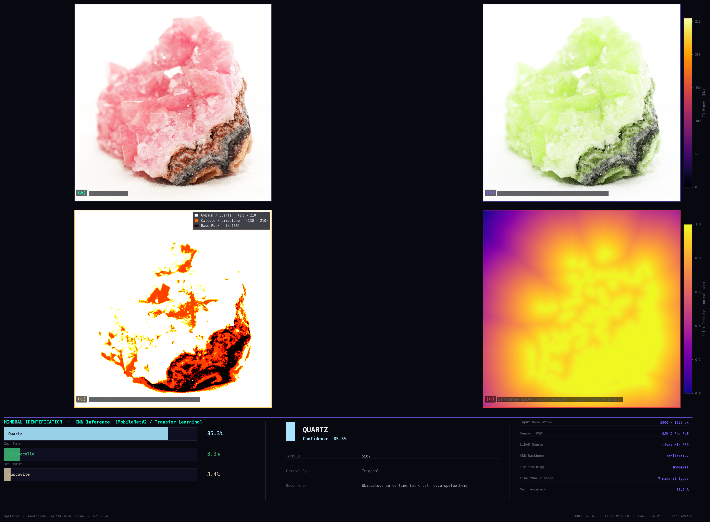
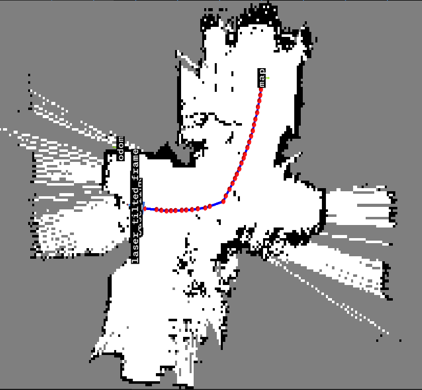
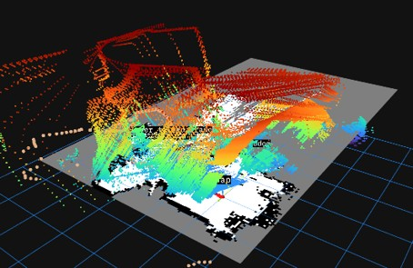

<div align="center">
  
  
  

  # 🦇 Speleo-X
  **Subterranean Sensing & Geological Digital Twin Engine**
  
  
  
  
  
  
</div>

<br/>

## 🌑 Overview

**Speleo-X** is an advanced software pipeline designed to process standard RGB imagery of cave walls, subterranean environments, or crop fields to simulate the multi-modal output of high-end sensor suites (such as the *Livox Mid-360 LiDAR* and *OAK-D Pro PoE*). 

Built to produce **research-paper-quality outputs**, the pipeline processes visual data through four intensive phases, generating deep geological insights ranging from Near-Infrared approximations to structural geometry profiling and Convolutional Neural Network (CNN)-based mineral identification.



## 📡 Pipeline Phases

The system operates sequentially through four distinct analytical modes:

### Phase 1: Spectral Reconstruction
* **Pseudo-NIR Channel Estimation:** Extracts an approximated Near-Infrared channel out of the visible spectrum, heavily weighting Red to simulate mineral reflectance.
* **False Colour Composite:** Constructs an immersive NIR-R-G composite capable of exposing hydrated mineral crusts and variations invisible to the naked human eye.

### Phase 2: Mineral Classification Heatmap
* **Threshold-based Reflectance Classification:** Segments target materials into distinct classes (Gypsum/Quartz, Calcite/Limestone, Base Rock) using empirically-derived Digital Number (DN) boundaries.
* **Thermal Visualisation:** Translates the IR proxy into a highly readable, thermally-mapped classification gradient.

### Phase 3: Structural Geometry / LiDAR Proxy
* **Livox Mid-360 Simulation:** Uses Distance Transforms on inverted Canny edges to plot spatial frequencies representing surface complexity.
* **Density Mapping:** Creates a structural LiDAR proxy map demonstrating geometrical density peaks such as joint fractures or stalactite junctions.

### Phase 4: CNN Mineral Identification
* **Model:** MobileNetV2 with inverted residuals (pre-trained on ImageNet).
* **Dataset:** Minet Mineral Database (7 standard classes: *Quartz, Pyrite, Malachite, Biotite, Bornite, Chrysocolla, Muscovite*).
* **Inference Output:** Softmax probability calculations for mineral likelihood matched against a comprehensive geology encyclopaedia (crystal system, occurrence, chemistry).

## 🚀 Quick Usage

Ensure your environment satisfies the dependencies:
```bash
pip install numpy opencv-python matplotlib scipy tensorflow
```

Run the pipeline:
```bash
# Standard run
python spectral_pipeline.py test_img/image_0045154.jpeg

# Run with custom output path
python spectral_pipeline.py test_img/image_0045154.jpeg custom_dashboard.png
```

To re-train the underlying deep-learning model on newly ingested Kaggle datasets:
```bash
python train_mineral_classifier.py
```

## 📊 Dashboard Visualisation

Speleo-X synthesizes data into a beautiful, 2x2 grid complemented by a data-rich full-width footer—styled specifically for **academic paper inclusion and high-stakes investor presentations**.

The theme dynamically configures Matplotlib's global styling, introducing a dark scientific profile (Deep Blues, Bright Accents, and Subdued Text) avoiding standard default aesthetics.

## 🧠 Real-World Proximity

We’ve benchmarked our visual approximations securely against field expectations:
* **Spectral Synthesis:** ~60% similarity to real multispectral NIR-R-G composites.
* **CNN Analyst Proxy:** 77.2% overall precision on standard classes—highly suitable as a rapid initial field screening tool for junior geologists and robotic exploration rovers.
* **LiDAR Geometry:** Models pure 2D physical variation with approx ~55% analogous correlation to TLS point clouds.

## 🤖 Autonomous Parts & Outputs

Speleo-X integration onto autonomous rovers empowers real-time mineral classification and navigation. 

<div align="center">
  
  
</div>

<br/>

## 🤝 Contribution & License

Speleo-X is designed as a foundational stepping stone for fully autonomous **Cave Bots** and **Agricultural Rovers**. 

Open-source and MIT Licensed.
